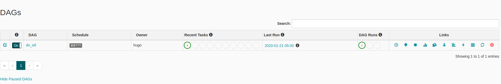
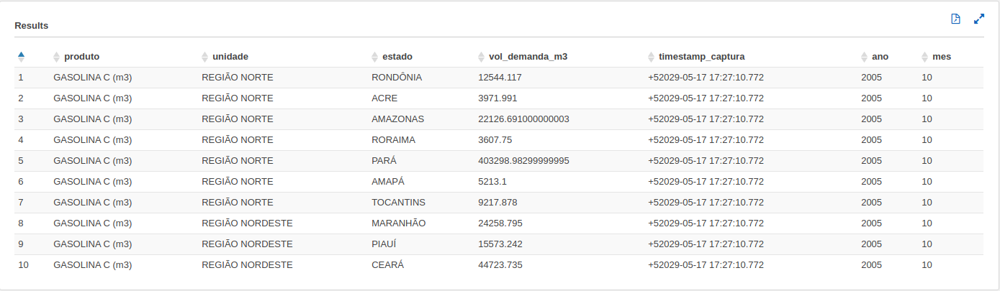

# Diesel oil ETL

This project objective is to extract some caches from pivots tables in a xls file, transform and store this data into a partitioned table.

## Dependencies

* Based on Python (3.7-slim-stretch) official Image [python:3.7-slim-stretch](https://hub.docker.com/_/python/) and uses the official [Postgres](https://hub.docker.com/_/postgres/) as backend and [Redis](https://hub.docker.com/_/redis/) as queue
* Install [Docker](https://www.docker.com/)
* Install [Docker Compose](https://docs.docker.com/compose/install/)

## Build and Usage
This will start an airflow webserver using LocalExecutor with matadata stored in postgres.

    docker-compose up --build -d
    
Access **127.0.0.1:8080** to see the airflow webserver.


 
## The do_etl DAG

This Dag uses airflow Python Operator to execute some python scripts.

Basically, this dag receives an xls file as input, then converts the file to xlsx, extracts the caches tables from pivots and store each one as  a csv file. 
Following, the next task creates a dataframe from one of the pivots, does some transformation in the data and stores it in 

    data/processed/2020_01_22_19_28_53/Vendas_de_Combustiveis_m3_partitioned' 

as a partitioned table by 'ano' and 'mes' columns in parquet format.

## Acessing the partitioned data

This structure can be loaded in several databases as a partitioned table for consulting.

Use these statements to create the table in AWS Athena for example:  

```
CREATE EXTERNAL TABLE `vendas_de_combustiveis_m3`(
  `produto` string, 
  `unidade` string, 
  `estado` string, 
  `vol_demanda_m3` double, 
  `timestamp_captura` timestamp)
PARTITIONED BY ( 
  `ano` int,
  `mes` int)
ROW FORMAT SERDE 
  'org.apache.hadoop.hive.ql.io.parquet.serde.ParquetHiveSerDe' 
STORED AS INPUTFORMAT 
  'org.apache.hadoop.mapred.TextInputFormat' 
OUTPUTFORMAT 
  'org.apache.hadoop.hive.ql.io.HiveIgnoreKeyTextOutputFormat'
LOCATION
  's3://'
```

Then load the partitions with:

    MSCK REPAIR TABLE vendas_de_combustiveis_m3;
    
Then with a  

    SELECT * FROM vendas_de_combustiveis_m3 limit 10; 

you will have something like this:

